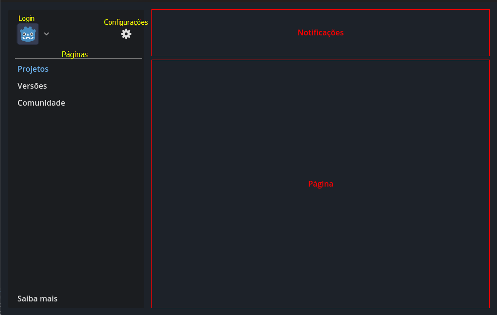
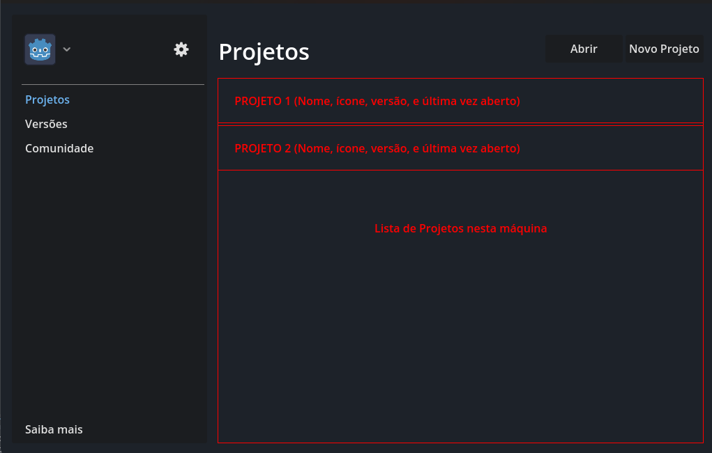

# Godot Hub - Gerenciador de Projetos e Versões para a Game Engine Godot

O Godot Hub é uma ferramenta projetada para simplificar o gerenciamento de projetos na renomada Game Engine [Godot](https://godotengine.org). Inspirado no conceito do bem-sucedido Unity Hub, nosso objetivo é facilitar o processo de versionamento de múltiplos projetos em diferentes versões da Engine, garantindo que você possa manter seus produtos de forma eficiente e eficaz.

## Público-Alvo
O Godot Hub é voltado para desenvolvedores que usam a Godot Engine e trabalham com múltiplos projetos em diferentes versões da Engine. 

## Tecnologias e Frameworks
O Godot Hub é desenvolvido com as seguintes tecnologias, bibliotecas e frameworks:

- [Electron](https://www.electronjs.org/): Um framework para criar aplicativos desktop multiplataforma usando tecnologias web.
- [Tailwind CSS](https://tailwindcss.com/): Um framework CSS altamente personalizável e baseado em classes.
- [React](https://react.dev/): Uma biblioteca JavaScript popular para criar interfaces de usuário interativas.

## Estrutura
Combinando o já existente gerenciador de projetos inicial da Godot Engine ao popular UnityHub, o projeto toma o seguinte layout:

> Exemplos

### Pág1. Projetos
Lista dos projetos instalados, capaz de abrir e criar novos projetos

### Pág2. Versões
Lista de versões instaladas na máquina, capaz de listar baixar novas versões diretamente do site oficial

### Pág3. Comunidade
Âncoras e/ou *iframe* com documentação e o [blog oficial](https://godotengine.org/blog/) da Godot Engine

### Pág4. Saiba mais
Créditos e informações dos desenvolvedores

### Outras Páginas
- Login para identificação de usuário e geração de perfis de uso.
- Configuração para alocação de arquivos de instalação e preferências do usuário

## Equipe de Desenvolvimento
- Kauan Biring Fontanela
- Lucas Adriano dos Anjos
- Tainara da Rosa
- Luis Henrique Parker
