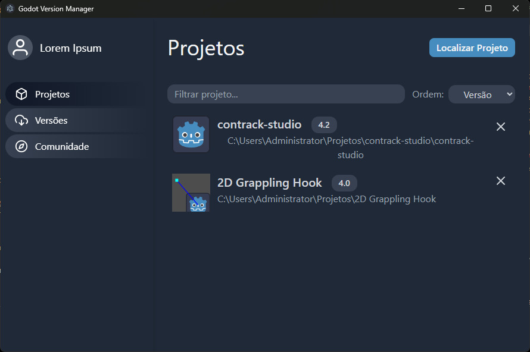

# Godot Hub - Gerenciador de Projetos e Versões para a Game Engine Godot  ${- \color{#9a6700}\textit{ Projeto Universitário}}$

O Godot Hub é uma ferramenta projetada para simplificar o gerenciamento de projetos na renomada Game Engine [Godot](https://godotengine.org). Inspirado no conceito do bem-sucedido Unity Hub, nosso objetivo é facilitar o processo de versionamento de múltiplos projetos em diferentes versões da Engine, garantindo que você possa manter seus produtos de forma eficiente e eficaz.

## Público-Alvo
O Godot Hub é voltado para desenvolvedores que usam a Godot Engine e trabalham com múltiplos projetos em diferentes versões da Engine. 

## Tecnologias e Frameworks
O Godot Hub é desenvolvido com as seguintes tecnologias, bibliotecas e frameworks:

- [Electron](https://www.electronjs.org/): Um framework para criar aplicativos desktop multiplataforma usando tecnologias web.
- [Tailwind CSS](https://tailwindcss.com/): Um framework CSS altamente personalizável e baseado em classes.
- [React](https://react.dev/): Uma biblioteca JavaScript popular para criar interfaces de usuário interativas.

## Conceito da Estrutura
Combinando o já existente gerenciador de projetos inicial da Godot Engine ao popular UnityHub, o projeto toma o seguinte layout:

- Principal referência *(unity hub)*

- Ideia inicial

## Execução
### Pág1. Projetos
- Lista editável dos projetos localizados no aplicativo, mostrando sua versão e diretório

- Oferece funções para filtrar e ordenar os projetos afim de facilitar a busca:

- Ao clicar no projeto, oferece uma lista com todas versões compatíveis instaladas para abrir o projeto

### Pág2. Versões
- Lista de versões disponíveis online e localmente,

Os botões de `Release` e `Changelog` redirecionam para as páginas oficiais do Godot. Versões baixadas oferecem a opção `Abrir` e versões disponíveis para download oferecem a opção `Baixar`

- Há uma barra de pesquisa para filtrar versões de maneira rápida

### Pág3. Comunidade
Âncoras e/ou *iframe* com documentação e o [blog oficial](https://godotengine.org/blog/) da Godot Engine

### Outras Páginas
- Login para identificação de usuário e geração de perfis de uso.

## Equipe de Desenvolvimento
- Kauan Biring Fontanela
- Lucas Adriano dos Anjos
- Tainara da Rosa
